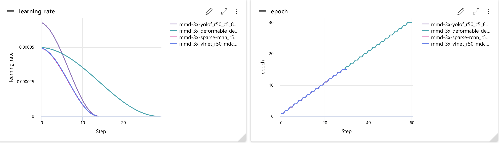
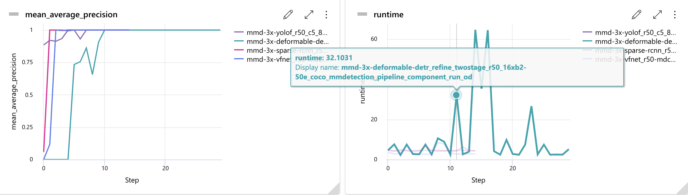

# Surface Landmines Object Detection Models Comparison

# Fine Tune Metrics - ### YOLOF, VFNET, DETR, SPARSE

### Comparison Charts

  <a href="https://github.com/UnVeilX/slm-od-ml-comparison/blob/main/comparison/model_comparison-chart-1.png">

  <a href="https://github.com/UnVeilX/slm-od-ml-comparison/blob/main/comparison/model_comparison-chart-2.png">

  <a href="https://github.com/UnVeilX/slm-od-ml-comparison/blob/main/comparison/model_comparison-chart-3.png">

  <a href="https://github.com/UnVeilX/slm-od-ml-comparison/blob/main/comparison/model_comparison-chart-4.png">

  <a href="https://github.com/UnVeilX/slm-od-ml-comparison/blob/main/comparison/model_comparison-chart-5.png">

  <a href="https://github.com/UnVeilX/slm-od-ml-comparison/blob/main/comparison/model_comparison-chart-6.png">

  <a href="https://github.com/UnVeilX/slm-od-ml-comparison/blob/main/comparison/model_comparison-chart-7.png">

### Comparison Table

  <a href="https://github.com/UnVeilX/slm-od-ml-comparison/blob/main/comparison/model_comparison-table-1.png">

  <a href="https://github.com/UnVeilX/slm-od-ml-comparison/blob/main/comparison/model_comparison-table-2.png">

  <a href="https://github.com/UnVeilX/slm-od-ml-comparison/blob/main/comparison/model_comparison-table-3.png">

  <a href="https://github.com/UnVeilX/slm-od-ml-comparison/blob/main/comparison/model_comparison-table-4.png">

#### References

https://arxiv.org/pdf/2409.02278

https://arxiv.org/pdf/2310.19909

https://arxiv.org/pdf/2212.06218
